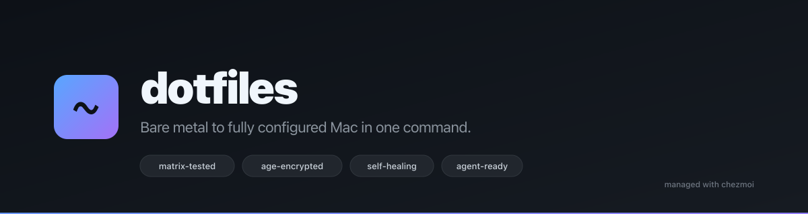
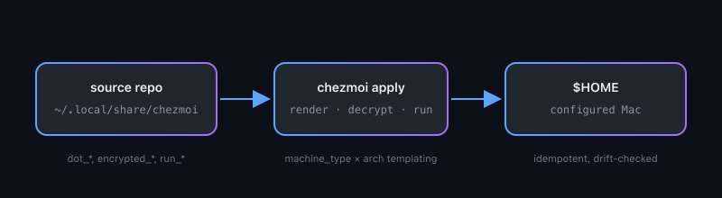

<div align="center">



[](https://github.com/edjchapman/dotfiles/actions/workflows/ci.yml)
[](https://github.com/edjchapman/dotfiles/releases)
[](LICENSE)
[](https://github.com/edjchapman/dotfiles/commits/main)
[](https://github.com/edjchapman/dotfiles/stargazers)
[](https://www.chezmoi.io/)

</div>

A reproducible, privacy-hardened macOS configuration. One command bootstraps a clean Mac into a fully configured environment: shell, packages, git, encrypted secrets, macOS preferences, Dock, firewall, and Claude Code config. Drift between `$HOME` and the source is detected from the shell banner; remediation is a single `mac` command.

## Bootstrap a clean Mac

```bash
sh -c "$(curl -fsLS get.chezmoi.io)" -- init --apply edjchapman
```

Drop your age private key in `~/.config/chezmoi/key.txt` first — see [`docs/runbooks/new-machine.md`](docs/runbooks/new-machine.md) for the full procedure (~30 minutes wall-clock, mostly waiting on Homebrew).

## Demo

```text
$ mac
─── drift summary ──────────────────────────────────────────
  ✓ $HOME files          in sync
  ✓ Brewfile             in sync
  ✓ macOS defaults       in sync
  ✓ security baseline    in sync (FileVault, SIP, firewall, keys, perms)
  ✓ external pins        in sync (oh-my-zsh, claude-code-config)

No drift detected.
```

When something is out of sync, `mac` summarises what changed and offers a one-keystroke remediation menu. The same check runs at every shell startup as a banner, and again at 09:30 daily as a clickable macOS notification.

A rendered terminal recording lives at `assets/demo/bootstrap.gif` (source: [`assets/demo/bootstrap.tape`](assets/demo/bootstrap.tape) — render with `brew install vhs && vhs assets/demo/bootstrap.tape`).

## Why this exists

Most Mac dotfiles repos are shell scripts that install packages and symlink config files. This one started as that, then accreted a layer of safety nets over ~2 years: templating to support both a personal and a work machine from one source tree, age-encrypted secrets so credentials can live in the repo, idempotent scripts so re-running is safe, drift detection so manual edits to `$HOME` don't silently rot the source state, and a CI matrix that validates the templates across `personal/work × arm64/amd64` before any change merges.

The result is closer to a small piece of ops infrastructure than to a personal config dump. It is also why a clean Mac to fully configured takes ~30 minutes of wall-clock time — most of it Homebrew waiting on downloads — and one decision: the machine type.

Read [ADR-0001](docs/decisions/0001-chezmoi-as-source-of-truth.md) for why chezmoi is the foundation, [ADR-0002](docs/decisions/0002-age-encryption.md) for why age, and [ADR-0004](docs/decisions/0004-rebrand-public-showcase.md) for why this README looks the way it does.

## Highlights

<table>
<tr>
<td width="50%" valign="top">

### Matrix-tested templates

Every `.tmpl` is rendered against four `(machine_type, arch)` combinations on every commit. Templates that break on Intel-but-not-Apple-Silicon (or work-but-not-personal) fail CI, not next month's reinstall.

[`docs/decisions/0003-machine-type-templating.md`](docs/decisions/0003-machine-type-templating.md)

</td>
<td width="50%" valign="top">

### Drift detection + `mac`

A shell-startup banner runs the drift check on every new terminal; a LaunchAgent fires the same check at 09:30 daily as a clickable notification. `mac` is the one alias to call when anything is flagged — it summarises and walks you through fixing each source of drift.

[`docs/runbooks/recover-from-drift.md`](docs/runbooks/recover-from-drift.md)

</td>
</tr>
<tr>
<td width="50%" valign="top">

### Age-encrypted secrets, draft-PR-only updates

Secrets live in the repo as `*.age` blobs encrypted to a single recipient. Pre-commit hooks (`gitleaks`, `ggshield`) and a monthly full-history audit catch accidental leaks. Self-update workflows for external pins open **draft** PRs only — nothing auto-merges, nothing auto-applies.

[`docs/runbooks/secret-rotation.md`](docs/runbooks/secret-rotation.md)

</td>
<td width="50%" valign="top">

### Weekly self-update PRs for pinned externals

`oh-my-zsh` is pinned by SHA. A weekly workflow checks for upstream commits, bumps the pin, and opens a draft PR you review like any other change. The `claude-code-config` external rebases locally at apply time with a 168-hour refresh window.

[`.chezmoiexternal.toml`](.chezmoiexternal.toml)

</td>
</tr>
<tr>
<td colspan="2" valign="top">

### First-class Claude Code integration

Project-scoped Claude Code config ships in the repo: a tuned `.claude/settings.json`, chezmoi-aware subagents (`chezmoi-template-validator`, `dotfile-drift-reporter`), slash commands (`/preview`, `/verify-templates`, `/add-secret`, `/sync-externals`), and a path-scoped rule file per file pattern. `CLAUDE.md` is the agent brief; `AGENTS.md` is the short brief for non-Claude agents.

[`CLAUDE.md`](CLAUDE.md) · [`AGENTS.md`](AGENTS.md) · [`.claude/`](.claude/)

</td>
</tr>
</table>

## How it works

<div align="center">



</div>

The source is a single git repo. `chezmoi apply` reads templates, evaluates them against the machine's `machine_type` and `arch`, decrypts the `*.age` blobs with the local age key, and writes the result into `$HOME`. Idempotent `run_once_*` and `run_onchange_*` scripts handle bootstrap, post-install, and re-runnable mutations. Anywhere the system drifts from the source, `mac` reports it.

## Compared to other dotfiles repositories

| Repo | Stars | Templating | Encrypted secrets | Self-healing | Agent-ready |
|---|---|---|---|---|---|
| **edjchapman/dotfiles** | — | ✓ chezmoi, matrix-tested | ✓ age | ✓ `mac` | ✓ CLAUDE.md |
| [mathiasbynens/dotfiles](https://github.com/mathiasbynens/dotfiles) | 32k+ | ✗ | ✗ | ✗ | ✗ |
| [holman/dotfiles](https://github.com/holman/dotfiles) | 9k+ | ✗ | ✗ | ✗ | ✗ |
| [thoughtbot/dotfiles](https://github.com/thoughtbot/dotfiles) | 9k+ | ✗ | ✗ | ✗ | ✗ |
| [paulirish/dotfiles](https://github.com/paulirish/dotfiles) | 7k+ | ✗ | ✗ | ✗ | ✗ |
| [nicknisi/dotfiles](https://github.com/nicknisi/dotfiles) | 4k+ | ✗ | ✗ | ✗ | ✗ |

Longer per-repo notes are in [`docs/comparison.md`](docs/comparison.md). Suggestions and corrections welcome via [discussions](https://github.com/edjchapman/dotfiles/discussions).

## Day-to-day commands

<details>
<summary><strong>When you'd use which alias</strong></summary>

| When | Command |
|---|---|
| Shell says "run `mac`" | `mac` |
| Change a config | `chezmoi cd` → edit → `chezmoi diff` → `chezmoi apply` |
| Pull updates from another machine | `chezmoi update` |
| Inspect today's brew upgrade output | `brewlog` |

`mac` is the one entry point for anything the system has flagged. It refreshes the drift check, summarises what's pending across home files, brew packages, macOS defaults, and security baseline, then walks you through fixing it. If nothing is wrong it says so and exits.

</details>

<details>
<summary><strong>What runs automatically</strong></summary>

| What | When | Where to look |
|---|---|---|
| **Homebrew upgrades** (`brew upgrade && brew doctor && brew cleanup`) | Once per day, on first shell of the day | `brewlog` (or `tail ~/.cache/brewup.log`) |
| Drift detection | Every new shell + 09:30 daily notification | Shell banner; `mac` to act |
| Brew install tracking | Every interactive `brew install/uninstall/...` | Shell banner shows pending count; `mac` merges into `Brewfile.tmpl` |
| Weekly draft PR for stale external pins | Mondays | GitHub Actions: `update-externals` |
| Monthly full-history secret scan | First of the month | GitHub Actions: `audit` |

Nothing auto-merges. Nothing auto-applies to `$HOME`. Updates land as draft PRs for you to review.

</details>

## Documentation

| | |
|---|---|
| [`docs/runbooks/`](docs/runbooks) | bootstrap, secret rotation, drift recovery, brew sync, branch protection |
| [`docs/decisions/`](docs/decisions) | architecture decision records (chezmoi, age, machine-type templating, rebrand) |
| [`docs/faq.md`](docs/faq.md) | common questions about scope, forking, drift, alternatives |
| [`docs/comparison.md`](docs/comparison.md) | how this compares to other popular dotfiles repos |
| [`CLAUDE.md`](CLAUDE.md) | agent brief: architecture, dangerous-ops, template vars |
| [`AGENTS.md`](AGENTS.md) | short brief for non-Claude agents |
| [`CONTRIBUTING.md`](CONTRIBUTING.md) | local verification, branch protection, conventions |
| [`SECURITY.md`](SECURITY.md) | private vulnerability reporting |
| [`CHANGELOG.md`](CHANGELOG.md) | release-by-release editorial summary |

## Roadmap

Open ideas and active threads live in [issues](https://github.com/edjchapman/dotfiles/issues) and [discussions](https://github.com/edjchapman/dotfiles/discussions). The README is intentionally not a roadmap doc — the issue tracker is.

## Contributing

PRs, discussions, and forks-with-improvements are all welcome. The repo is opinionated and scoped to one person's Mac, so not every idea fits, but well-framed problems are useful regardless. See [`CONTRIBUTING.md`](CONTRIBUTING.md).

## License

MIT. See [`LICENSE`](LICENSE).
