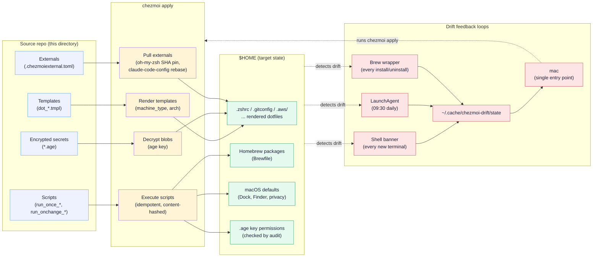

# Architecture

The repo is a chezmoi-managed source of truth for a Mac. Everything you see in `$HOME` either comes from this repo or is explicitly ignored. This page traces the end-to-end pipeline — what runs when you bootstrap a new machine, what runs when you `chezmoi apply`, and the three concurrent feedback loops that keep drift visible.

!!! tip "First time here?"
    Start with the [Quick start](runbooks/new-machine.md) for the operational walkthrough. This page explains the *system* — read it once, then come back to runbooks for the *procedures*.

## The pipeline at a glance

## Source layout

The source tree under `/Users/ed/.local/share/chezmoi` follows chezmoi's naming conventions strictly. Each prefix encodes intent:

`dot_NAME`
:   Deploys to `$HOME/.NAME`. Plain file, copied verbatim.

`dot_NAME.tmpl`
:   Deploys to `$HOME/.NAME` *after* template rendering. Template variables (`machine_type`, `arch`, `gpg_signing_key`, `chezmoi.homeDir`) substituted at apply time.

`encrypted_NAME.age` or `encrypted_dot_NAME.age`
:   Deploys to `$HOME/NAME` *after* decryption with the age key in `~/.config/chezmoi/key.txt`. Public recipient is committed; private key never is.

`private_NAME`
:   Deploys with `0600` permissions instead of `0644`.

`run_once_NAME.sh`
:   Runs once per machine on first apply. State recorded in chezmoi's state DB. Bootstrap territory.

`run_once_after_NAME.sh`
:   Runs once *after* all files are deployed. Used for `sudo` operations that depend on rendered files.

`run_onchange_NAME.sh.tmpl`
:   Re-runs whenever the rendered content hashes change. Used for Brewfile sync, macOS defaults, Dock layout.

`run_onchange_after_NAME.sh`
:   Re-runs when content changes, *after* all files (and externals) are in place. Used to wire the `~/.claude/*` symlinks into the `claude-code-config` external — a run script rather than `symlink_*` sources because `.chezmoiignore` ignores the `.claude` target path (to keep this repo's project-scoped `.claude/` out of `$HOME`), which excludes anything else chezmoi would deploy there.

## Render pipeline

When you run `chezmoi apply`, chezmoi:

1. **Reads init state** — `machine_type`, `gpg_signing_key`, `chezmoi.arch`, `chezmoi.homeDir` (all from `~/.config/chezmoi/chezmoi.toml`, populated at `chezmoi init` time from `.chezmoi.toml.tmpl` prompts).
2. **Renders every `.tmpl`** with those values. Templates that branch on `machine_type` produce different output for personal vs work; templates that branch on `chezmoi.arch` produce different output for Apple Silicon vs Intel.
3. **Decrypts every `encrypted_*`** with the private key. Failed decryption (missing key, wrong recipient) stops the apply.
4. **Diffs rendered output against `$HOME`**. Any difference is the next action.
5. **Executes `run_once_*` and `run_onchange_*`** in alphanumeric order, hashing each script's rendered content for the changetracking DB.

??? abstract "Why content hashes for `run_onchange`?"
    A naive "re-run every apply" approach would mean `brew bundle` runs every time you `chezmoi apply` — slow, noisy, and risks unintended upgrades. Content hashing means a `run_onchange_02-brew-bundle.sh.tmpl` script only re-runs when its *rendered* output changes, i.e. when you actually added or removed a `brew` line.

## Encryption flow

All secrets live in the repo as `*.age` blobs. The recipient (public key) is in `.chezmoi.toml.tmpl` and committed; the private key (`~/.config/chezmoi/key.txt`) is **never** committed and must be backed up out-of-band. The runbook for rotating the key — and for the four backup strategies — is in [Secret rotation](runbooks/secret-rotation.md).

!!! danger "Losing the age key"
    Without the key, every `*.age` blob in the repo is unrecoverable. `chezmoi apply` will fail at the decrypt step. Recovery on a new Mac requires either restoring the key from backup or generating a new keypair *and* re-encrypting every blob. See the [secret-rotation runbook](runbooks/secret-rotation.md#recovery-on-a-new-or-wiped-mac).

## Externals

`.chezmoiexternal.toml` pins two upstream sources:

| External | Type | Update channel |
|---|---|---|
| `oh-my-zsh` | Archive, pinned by SHA | Weekly draft PR via [`update-externals.yml`](https://github.com/edjchapman/dotfiles/blob/main/.github/workflows/update-externals.yml) |
| `claude-code-config` | Git repo, `rebase = true` | Local `git pull --rebase` at apply time, 168 h refresh window |

The two channels reflect the two trust models: `oh-my-zsh` is third-party, so every bump goes through review. `claude-code-config` is mine, so the update channel is `git pull`, not Dependabot-style review.

## Drift detection — three concurrent loops

Three signals continuously check `$HOME` against the source state. All three feed a single cache (`~/.cache/chezmoi-drift/state`), which the `mac` command consumes:

=== "Shell banner"
    Every new terminal sources `~/.zshrc`, which calls `chezmoi-drift-check` from a non-blocking subshell. Output appears as a banner at the top of the prompt if anything is pending.

=== "Daily LaunchAgent"
    A `LaunchAgent` fires at 09:30 daily, runs `chezmoi-drift-check`, and posts a clickable macOS notification if drift is detected. Clicking opens Terminal at `mac`.

=== "Brew wrapper"
    A shell function wrapper around `brew` appends an NDJSON event to `~/.cache/brewup.log` on every `install/uninstall/upgrade`, so the next `chezmoi-brew-sync` knows what to merge into `Brewfile.tmpl`.

Together: drift becomes *visible* in seconds and *fixable* with one command. See [Recover from drift](runbooks/recover-from-drift.md) for the per-signal remediation matrix.

## Where the system enforces correctness

| Layer | What it enforces | Where it lives |
|---|---|---|
| Pre-commit | Shellcheck, shfmt, yamllint, markdownlint, gitleaks, ggshield, chezmoi template render, mkdocs config validation, mermaid syntax, docs-nav completeness | [`.pre-commit-config.yaml`](https://github.com/edjchapman/dotfiles/blob/main/.pre-commit-config.yaml) |
| Push CI | 13 required checks: ShellCheck, shfmt, yamllint, markdownlint, gitleaks, pre-commit, four template matrix cells, plist XML, brew bundle check, docs checks | [`.github/workflows/ci.yml`](https://github.com/edjchapman/dotfiles/blob/main/.github/workflows/ci.yml), [`docs.yml`](https://github.com/edjchapman/dotfiles/blob/main/.github/workflows/docs.yml) |
| Branch protection | All 13 checks required, linear history, no force-push, no merge commits | [Runbook: branch protection](runbooks/branch-protection.md) |
| Local apply | `chezmoi verify` — silent if no drift | The `mac` workflow |
| Daily | LaunchAgent drift check at 09:30 | `~/Library/LaunchAgents/` |
| Weekly | Update PR for `oh-my-zsh` pin | [`update-externals.yml`](https://github.com/edjchapman/dotfiles/blob/main/.github/workflows/update-externals.yml) |
| Monthly | Full-history secret audit | [`audit.yml`](https://github.com/edjchapman/dotfiles/blob/main/.github/workflows/audit.yml) |

## Further reading

- [Decisions](decisions/index.md) — why chezmoi over stow/yadm, why age over GPG/sops, why `machine_type` templating over branches.
- [Recover from drift](runbooks/recover-from-drift.md) — what to do when the banner or notification fires.
- [Glossary](glossary.md) — terminology used across this site.
- [Comparison](comparison.md) — how this repo differs from other well-known dotfiles setups.
