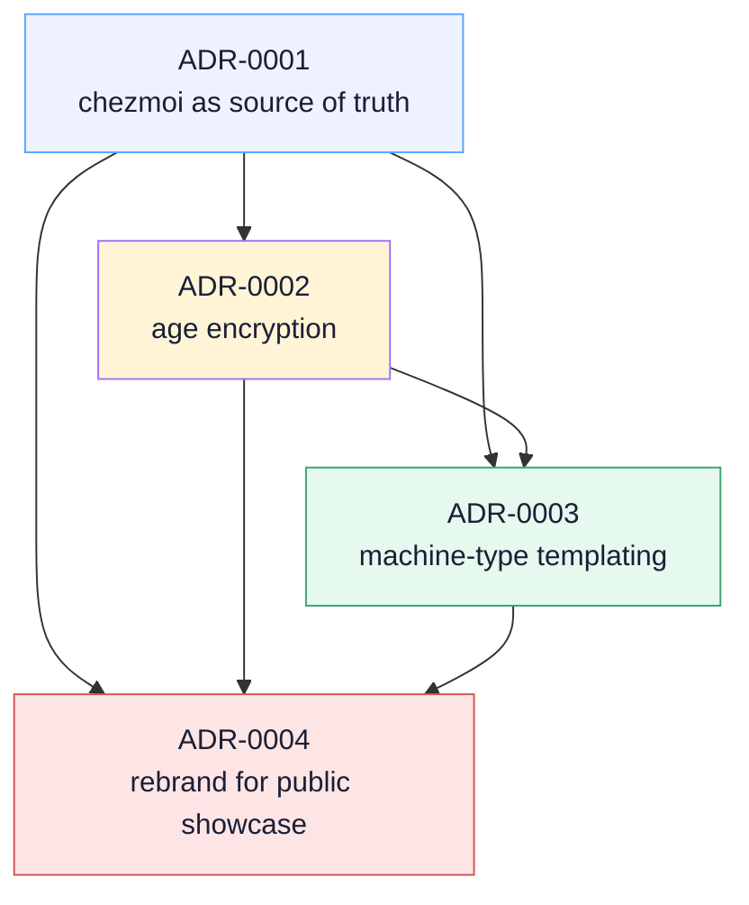

# Architecture Decisions

ADRs record the *why* behind the structural choices in this repo. Each is short, dated, and self-contained.

## Dependency graph

Each ADR builds on its predecessors: encryption is a chezmoi-native primitive (so 0002 depends on 0001), `machine_type` templating leverages both (so 0003 depends on 0001+0002), and the rebrand decision was deferred until the foundation was mature (so 0004 depends on all three).

## Index

- [ADR-0001 — chezmoi as the source of truth](0001-chezmoi-as-source-of-truth.md) — why chezmoi over stow, yadm, bare git, or shell scripts.
- [ADR-0002 — age encryption for secrets](0002-age-encryption.md) — why age over git-crypt, transcrypt, sops, or a separate password manager.
- [ADR-0003 — machine-type templating](0003-machine-type-templating.md) — why `personal` / `work` as a single boolean rather than per-topic opt-in.
- [ADR-0004 — rebrand for public showcase](0004-rebrand-public-showcase.md) — why the README, social preview, Pages site, and governance files were added in mid-2026; why no rename; why not flag as a template repository.

## When to write an ADR

A new ADR is warranted when:

- A structural choice (tool, framework, encoding, encryption scheme) is locked in and would be costly to reverse.
- The choice has been actively considered against alternatives, and the reasoning would be useful to future-you in 18 months.
- The decision changes a previous ADR — in which case the new ADR's `Status` reads `Supersedes ADR-NNNN` and the superseded ADR's status is updated to `Superseded by ADR-MMMM`.

For everything else — a one-off fix, a temporary workaround, a refactor that doesn't change the architecture — the commit message is the right home.

## Format

Each ADR uses the same headings:

1. **Status** — Accepted / Proposed / Superseded by …
2. **Date** — when accepted.
3. **Context** — what problem, what constraints.
4. **Decision** — what was chosen.
5. **Rationale** — why.
6. **Alternatives rejected** — what wasn't chosen, and why.
7. **Consequences** — what this commits the repo to going forward.

See [ADR-0001](0001-chezmoi-as-source-of-truth.md) for the canonical example.
