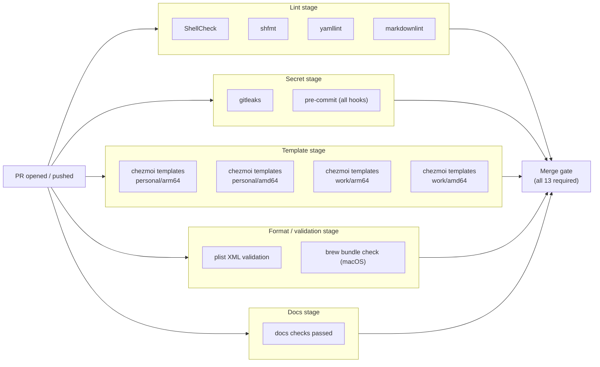

# Runbook: branch protection on `main`

The `main` branch is protected so that:

- **Direct pushes are blocked.** All changes go via PR.
- **All 13 CI checks must pass** before merge: `ShellCheck`, `shfmt`, `yamllint`, `markdownlint`, `gitleaks`, `pre-commit (all hooks)`, four `chezmoi templates (…)` matrix cells, `plist XML validation`, `brew bundle check (macOS)`, and `docs checks passed` (the aggregate of the dedicated docs CI workflow — see [`/.github/workflows/docs.yml`](https://github.com/edjchapman/dotfiles/blob/main/.github/workflows/docs.yml)).
- **Branches must be up to date with `main`** before merging (`strict: true`). This forces CI to re-run on the merge candidate, not the stale branch state.
- **Linear history.** No merge commits — only squash merges.
- **Conversation resolution required.** Inline review threads must be resolved before merge.
- **No force pushes**, **no deletions** of `main`.
- **Admin bypass enabled** (`enforce_admins: false`). You can always merge in emergencies.

!!! warning "Use admin bypass sparingly"
    `enforce_admins: false` is a fire-escape, not a daily-driver. Bypassing the 13 required checks defeats their purpose. Reserve for genuine emergencies (CI broken in a way that blocks all PRs) and document the reason in the PR description.

Repo-level merge settings reinforce this:

- Squash-merge only (`merge-commit` and `rebase-merge` disabled).
- Auto-delete branch on merge.
- Squash commit defaults: title from PR title, message from PR body.

## Check stages



## Recovering the protection

If branch protection ever gets removed (manually disabled, repo cloned to a new owner, etc.), recreate it with:

```bash
gh api -X PATCH repos/edjchapman/dotfiles \
  -F allow_merge_commit=false \
  -F allow_rebase_merge=false \
  -F allow_squash_merge=true \
  -F delete_branch_on_merge=true \
  -f squash_merge_commit_title=PR_TITLE \
  -f squash_merge_commit_message=PR_BODY

gh api -X PUT repos/edjchapman/dotfiles/branches/main/protection --input - <<'JSON'
{
  "required_status_checks": {
    "strict": true,
    "contexts": [
      "ShellCheck",
      "shfmt",
      "yamllint",
      "markdownlint",
      "gitleaks",
      "pre-commit (all hooks)",
      "chezmoi templates (personal / amd64)",
      "chezmoi templates (personal / arm64)",
      "chezmoi templates (work / amd64)",
      "chezmoi templates (work / arm64)",
      "plist XML validation",
      "brew bundle check (macOS)",
      "docs checks passed"
    ]
  },
  "enforce_admins": false,
  "required_pull_request_reviews": {
    "dismiss_stale_reviews": false,
    "require_code_owner_reviews": false,
    "required_approving_review_count": 0,
    "require_last_push_approval": false
  },
  "restrictions": null,
  "required_linear_history": true,
  "allow_force_pushes": false,
  "allow_deletions": false,
  "required_conversation_resolution": true,
  "lock_branch": false,
  "allow_fork_syncing": false
}
JSON
```

## Verifying current state

```bash
gh api repos/edjchapman/dotfiles/branches/main/protection -q '.required_status_checks.contexts'
gh api repos/edjchapman/dotfiles -q '.allow_squash_merge,.allow_merge_commit,.allow_rebase_merge,.delete_branch_on_merge'
```

## Updating the required-checks list

If a new CI job is added in `.github/workflows/ci.yml`, it will run on every PR but **will not be required** until added to the protection list. To require a new check, re-run the `gh api -X PUT …/protection` command with the updated `contexts` array.
