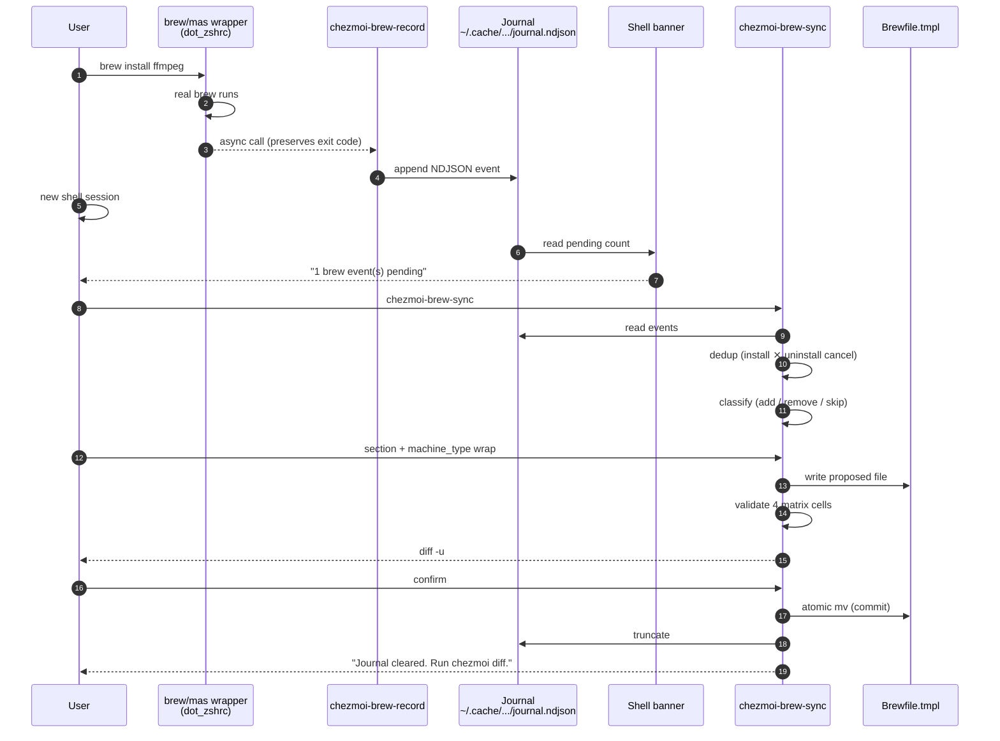

# Runbook: brew-sync — keep `Brewfile.tmpl` in step with `brew install`

When you run `brew install`, `brew uninstall`, `brew tap`, `brew untap`, or `mas install` outside the `Brewfile.tmpl` flow, the shell **records the event to a journal**. A separate interactive tool, `chezmoi-brew-sync`, merges the journal into `Brewfile.tmpl` under your review.

The tracked file is never edited behind your back: every change goes through `chezmoi-brew-sync`, which validates the resulting template across the full machine_type × arch matrix before replacing the file.

## Pipeline



## Components

| Piece | Where | What |
|---|---|---|
| `brew()` / `mas()` wrappers | `dot_zshrc` | After the real command exits, call `chezmoi-brew-record` async. Never alter the user-visible exit code. |
| `chezmoi-brew-record` | `~/.local/bin/` | Append one NDJSON line per package to the journal. Skips failed installs (`rc != 0`). |
| Journal | `~/.cache/chezmoi-brew-inbox/journal.ndjson` | Append-only NDJSON. One line per event. Truncated by `chezmoi-brew-sync` on confirmed merge. |
| Shell banner | `dot_zshrc` | Reads the journal on shell startup and prints "N brew event(s) pending — run chezmoi-brew-sync". Switches to red at ≥10 events. |
| Weekly notification | `com.user.chezmoi-brew-inbox.plist` | Posts a macOS notification every Monday 09:30 if the journal is non-empty. Prevents silent accumulation. |
| `chezmoi-brew-sync` | `~/.local/bin/` | Interactive merge. Reads journal, dedupes install/uninstall pairs, prompts for placement, validates, shows diff, replaces `Brewfile.tmpl` atomically. |

## Normal flow

```bash
$ brew install ffmpeg
# … brew runs normally …

# Next shell session:
$ zsh
chezmoi: 1 brew event(s) pending — run chezmoi-brew-sync

$ chezmoi-brew-sync
==> chezmoi-brew-sync — 1 pending action(s)

[1/1] add brew "ffmpeg"
  Sections:
    * 1) CLI Tools
       2) Build / Dev dependencies
       …
  Section number [1] (or 's' to skip): 1
  Wrap in {{ if eq .machine_type "personal" }} block? [y/N] n
  → brew "ffmpeg"

==> Validating template across machine_type × arch matrix...
  ✓ All 4 combinations render cleanly.

==> Diff vs current Brewfile.tmpl:
--- Brewfile.tmpl    2026-05-11 …
+++ /tmp/brewfile-sync.X    2026-05-11 …
@@ -14,6 +14,7 @@
 brew "eza"
 brew "fd"
 brew "findutils"
+brew "ffmpeg"
 brew "fnm"
…

Apply these changes and truncate journal? [y/N] y
✓ Brewfile.tmpl updated. Journal cleared.
Next: run 'chezmoi diff' then 'chezmoi apply' to install.
```

## What `chezmoi-brew-sync` does in detail

??? abstract "Step-by-step internals (click to expand)"

    1. **Sanity gate** — Requires `chezmoi` and `jq`. Aborts if `Brewfile.tmpl` has uncommitted changes (pass `--force` to stash; never auto-pops).
    2. **Mutex** — `mkdir`-based lock at `~/.cache/chezmoi-brew-inbox/.sync.lock`. Two concurrent syncs cannot race.
    3. **Dedup** — Reads the journal, collapses to the latest event per `(kind, name)`. Install-then-uninstall pairs cancel.
    4. **Classify** — For each resolved event:
        - `install` + not in file → propose **add**.
        - `install` + already in file → skip (no-op).
        - `uninstall` + in file → propose **remove**.
        - `uninstall` + not in file → skip (no-op).
    5. **Prompt** — For adds: section number + optional `{{ if eq .machine_type "personal" }}` wrap. Section suggestions are seeded by kind (formula → CLI Tools, cask → keyword routing). For removes: confirm yes/no.
    6. **Apply** — Writes proposed edits to a temp file. Insert positions preserve alphabetical order within each section; removes use line-anchored matches so only exact entries are deleted.
    7. **Validate** — Runs `chezmoi execute-template` across all 4 machine_type × arch combos. Aborts with the temp file kept (for inspection) if any combo fails to render.
    8. **Diff** — `diff -u` between live and proposed files.
    9. **Commit** — On `y`, atomic `mv` of the proposed file over the live one, then truncate the journal.

## Common situations

### "Brewfile.tmpl has uncommitted changes"

`chezmoi-brew-sync` refuses by design — silently merging into your in-progress edit is the failure mode most likely to lose work.

- Commit or discard your changes, then re-run.
- Or `chezmoi-brew-sync --force` to stash `Brewfile.tmpl` first. The stash is **never auto-popped**; run `git stash pop` (in `chezmoi cd`) when you're ready to reconcile.

### A pending entry should be wrapped in `{{ if eq .machine_type "personal" }}`

`chezmoi-brew-sync` asks per entry. Answer **y** when prompted. The line is wrapped in its own `{{ if … -}} … {{ end -}}` block at the chosen section's tail. You can later move it into an existing personal-only section by hand if you prefer the section-level grouping pattern.

### The journal accumulated 20+ entries

Shell banner turns red at ≥10. Run `chezmoi-brew-sync` and walk through them. The dedup step usually collapses a lot — `brew install foo && brew uninstall foo` produces zero net actions.

### "no tty available"

`chezmoi-brew-sync` must run from an interactive terminal — it prompts via `/dev/tty`. Cron/launchd cannot run it; the weekly launchd notification only **reminds** the user to run sync interactively.

### A `mas install <id>` event needs the human-readable app name

The journal stores only the numeric App Store ID (that's all `mas install` takes). `chezmoi-brew-sync` prompts for the display name (look it up with `mas info <id>`). The resulting Brewfile line is `mas "Name", id: <id>`.

### I want to forget what's in the journal

```bash
: > ~/.cache/chezmoi-brew-inbox/journal.ndjson
```

The next sync run will exit "journal empty — nothing to do".

### `chezmoi-brew-sync` failed validation and bailed

The proposed file is kept at the temp path the script prints. Inspect it, fix `Brewfile.tmpl` by hand, then re-run sync to clear the journal.

## What this loop does **not** do

- It does not auto-edit `Brewfile.tmpl` from the shell. The wrapper is a recorder; only `chezmoi-brew-sync` writes to the file.
- It does not handle `brew upgrade` events — version pinning is not modelled in `Brewfile.tmpl` (the file describes "what should be installed", not "at what version").
- It does not handle VS Code extensions installed inside VS Code — those are managed separately by the weekly `update-vscode.yml` workflow draft PR.
- It does not auto-commit the resulting `Brewfile.tmpl` change. Run `chezmoi diff` and `git commit` yourself.

## See also

- [`recover-from-drift.md`](recover-from-drift.md) — broader drift-recovery procedures (home files, Brewfile drift detection signals).
- [`new-machine.md`](new-machine.md) — bootstrap procedure for a fresh machine.
