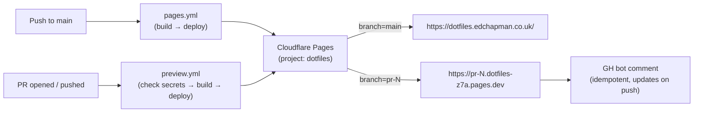

# Runbook: Cloudflare Pages deploys

The docs site is served by **Cloudflare Pages**. Two distinct surfaces share one project (`dotfiles`):

| Surface | Trigger | URL | Workflow |
|---|---|---|---|
| **Production** | Push to `main` | <https://dotfiles.edchapman.co.uk/> (alias: <https://dotfiles.edwardchapman.co.uk/> → 301) | [`pages.yml`](https://github.com/edjchapman/dotfiles/blob/main/.github/workflows/pages.yml) |
| **Per-PR preview** | PR open / push | `https://pr-N.dotfiles-z7a.pages.dev` (PR number in subdomain; bot comment posts the URL) | [`preview.yml`](https://github.com/edjchapman/dotfiles/blob/main/.github/workflows/preview.yml) |

GitHub Pages is retired. The previous URL `edjchapman.github.io/dotfiles/` no longer serves the site — see [Custom domain](custom-domain.md) for the migration history.

Cloudflare appends a 3-char suffix (`-z7a`) to the project subdomain for uniqueness across all customers. The exact suffix is hardcoded as `CF_SUBDOMAIN` in [`preview.yml`](https://github.com/edjchapman/dotfiles/blob/main/.github/workflows/preview.yml); update there if you rename the subdomain in CF dashboard → Pages → Settings → Domains.

## How it works



Cloudflare handles:

- TLS + CDN
- Unique URL per PR branch
- Auto-cleanup when the PR closes (preview retained 30 days)
- Build artefact caching
- Per-branch deployment isolation (the `--branch` flag on `wrangler pages deploy` decides whether the deploy is treated as production or preview)

## Production deploy

### Trigger

Push to `main` touching any of: `docs/**`, `mkdocs.yml`, any of the four root-mirrored project files (`CHANGELOG.md`, `CONTRIBUTING.md`, `SECURITY.md`, `CODE_OF_CONDUCT.md`), or `pages.yml` itself. Also manually via `gh workflow run pages.yml`.

### Pipeline

1. Install Cairo + Pango via `awalsh128/cache-apt-pkgs-action@v1` (cached between runs).
2. Set up Python 3.12 with pip cache keyed on `docs/requirements.txt`.
3. `pip install -r docs/requirements.txt`.
4. `mkdocs build --strict` → outputs to `site/`.
5. `wrangler pages deploy site --project-name=dotfiles --branch=main`.
6. Cloudflare serves the new build at `https://dotfiles.edchapman.co.uk/` within ~30 seconds of the workflow finishing.

### Rolling back

If a bad deploy lands:

- Cloudflare dashboard → Pages → `dotfiles` → **Deployments** → find the previous good deployment → **Rollback to this deployment**.
- The custom domains immediately re-route to that deployment. No code change needed.
- After rollback, fix forward via a new PR; do **not** rewrite history.

## PR preview deploys

### Trigger

PR opened or pushed (path-gated on the same set as production), or manual via `gh workflow run preview.yml -f pr_number=<N>`.

### Pipeline

1. Soft-gate on `CLOUDFLARE_API_TOKEN` and `CLOUDFLARE_ACCOUNT_ID` — workflow exits with a notice if missing.
2. Same install + build as production, plus two preview-specific edits to `mkdocs.yml` before build:
    - Set `site_url` to `https://pr-N.dotfiles-z7a.pages.dev/` so canonical/sitemap/feed entries resolve to the preview origin.
    - Strip the `mkdocs-rss-plugin` block — the plugin HEAD-fetches social-card images to populate the RSS `<enclosure length>`, which fails on first-time-deployed pages.
3. `wrangler pages deploy site --project-name=dotfiles --branch=pr-<N>`.
4. `peter-evans/find-comment` + `create-or-update-comment` to post (or update) the `<!-- docs-preview -->` comment on the PR with the deploy URL.

### Why no custom domain on previews

Previews are ephemeral and per-PR. Giving them a custom domain would:

- Inflate certificate provisioning load (a TLS cert per PR).
- Provide no SEO value (search engines should not index preview URLs).
- Require manual DNS hygiene on every PR open/close.

The `pr-N.dotfiles-z7a.pages.dev` URL serves the purpose with zero per-PR setup.

## One-time setup (15 minutes)

### 1. Create a Cloudflare account + Pages project

- Sign up at <https://dash.cloudflare.com> if you don't have an account.
- Workers & Pages → **Create application** → **Pages** tab → **Direct Upload** (NOT "Connect to Git" — the workflow does the build).
- **Project name**: `dotfiles` (must match `--project-name=dotfiles` in `pages.yml` and `preview.yml`).
- Drop a placeholder file to initialise; the workflow replaces it on first push.

### 2. Generate an API token

- Cloudflare dashboard → My Profile → API Tokens → Create Token → Custom token.
- **Permissions**: Account → Cloudflare Pages → Edit.
- **Account Resources**: include your account only.
- Copy the token immediately (it's only shown once).

### 3. Add two secrets to the GitHub repo

```bash
gh secret set CLOUDFLARE_API_TOKEN
gh secret set CLOUDFLARE_ACCOUNT_ID
```

The account ID is in the Cloudflare dashboard sidebar (or `Account Home → Account ID`).

### 4. Attach custom domains

See [Custom domain](custom-domain.md) for the canonical + alias setup, Gandi CNAME records, and the 301 redirect rule.

### 5. Push something to main

The `pages.yml` workflow fires, builds the docs, deploys to Cloudflare Pages production, and the site goes live at `https://dotfiles.edchapman.co.uk/` once DNS + custom domains are wired.

## Operational notes

- **Soft gate** (preview only): if the Cloudflare secrets are missing, `preview.yml` exits early with a notice and a green check. Production `pages.yml` does NOT soft-gate — missing secrets there fail the deploy loudly, because production is supposed to deploy.
- **Fork PRs**: `preview.yml`'s `if: github.event.pull_request.head.repo.full_name == github.repository` guard skips fork PRs (they can't access repo secrets). Manual deploy via `workflow_dispatch` is the workaround.
- **Concurrency**: production `pages.yml` runs sequentially (group `pages-prod`, no cancel). Preview deploys cancel in-progress runs for the same branch — only the latest commit's preview survives.
- **Idempotent comment**: the bot finds an existing `<!-- docs-preview -->` comment on the PR and edits it in place rather than spamming.
- **Cost**: Cloudflare Pages free tier covers 500 builds/month and unlimited bandwidth. Far over what this repo needs.

## Disabling

To turn off PR previews:

- Remove `CLOUDFLARE_API_TOKEN` and/or `CLOUDFLARE_ACCOUNT_ID` from repo secrets — `preview.yml` auto-skips.
- Or delete `.github/workflows/preview.yml`.

The `docs.yml` checks workflow is independent and continues regardless.

To turn off production deploys:

- Disable `pages.yml` workflow in repo settings → Actions → manage workflows.
- Or revert `pages.yml` to the old GitHub Pages flow (`actions/deploy-pages@v4`) — see git history before the migration.

## Troubleshooting

| Symptom | Cause | Fix |
|---|---|---|
| `preview.yml` exits "Cloudflare secrets not configured" | One or both secrets missing | `gh secret list` to confirm; re-add via `gh secret set`. |
| Preview comment URL 404s for a moment | DNS / CF cache warming | Wait 30 s; refresh. |
| Production deploy fails with "Project not found" | CF project named differently than `dotfiles`, or deleted | Rename via CF dashboard (Pages project → Settings → Project name), or update `--project-name=` in `pages.yml`. |
| Build fails on Cairo | apt mirror flake | `awalsh128/cache-apt-pkgs-action` retries; if first-time uncached, second run hits the cache. |
| Preview shows old content | Cloudflare edge cache | Append `?nocache=1` to URL. Flushes within ~30 s of a deploy. |
| Production site stale | Edge cache or wrong DNS pointer | Check CF dashboard → Pages → Deployments shows your commit. Then `dig CNAME dotfiles.edchapman.co.uk` should resolve to `dotfiles-z7a.pages.dev`. |
| `Workers Builds: dotfiles` red on PRs | CF Workers GitHub integration still connected | Worker `dotfiles` → Settings → Builds → Disconnect Git repository. |

## See also

- [Custom domain](custom-domain.md) — wiring `dotfiles.edchapman.co.uk` + `dotfiles.edwardchapman.co.uk` to the Cloudflare Pages project.
- [Branch protection](branch-protection.md) — required CI checks; both `pages.yml` (production) and `preview.yml` are intentionally NOT required.
- [`pages.yml`](https://github.com/edjchapman/dotfiles/blob/main/.github/workflows/pages.yml) — production deploy.
- [`preview.yml`](https://github.com/edjchapman/dotfiles/blob/main/.github/workflows/preview.yml) — per-PR preview deploy.
