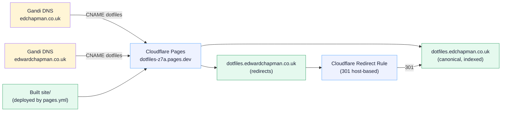

# Runbook: Custom domain

The docs site is served from `https://dotfiles.edchapman.co.uk/` (canonical) and `https://dotfiles.edwardchapman.co.uk/` (301-redirects to canonical). Both domains are registered at Gandi; DNS stays at Gandi; Cloudflare Pages handles TLS, CDN, and the redirect.

This runbook covers cold-start setup, verification, recovery, and the previous GitHub Pages → Cloudflare Pages migration.

## Topology



## Confirmed configuration

| Setting | Value |
|---|---|
| Canonical URL | `https://dotfiles.edchapman.co.uk/` |
| Alias URL | `https://dotfiles.edwardchapman.co.uk/` (301 to canonical) |
| Domain registrar | Gandi (both domains) |
| DNS authority | Gandi (no nameserver migration) |
| Pages project | `dotfiles` (subdomain `dotfiles-z7a.pages.dev`) |
| Production deploy | `pages.yml` → `wrangler pages deploy site --project-name=dotfiles --branch=main` |
| TLS | Auto-provisioned by Cloudflare |

## Cold-start setup

### 1. Attach custom domains to Cloudflare Pages

Cloudflare dashboard → **Workers & Pages** → `dotfiles` → **Custom domains** → **Set up a custom domain**.

Repeat for both domains:

- `dotfiles.edchapman.co.uk`
- `dotfiles.edwardchapman.co.uk`

After each, Cloudflare displays the **CNAME target** to use at the DNS provider. It's `dotfiles-z7a.pages.dev` (the project subdomain).

!!! note "CF asks if you want CF to manage DNS"
    Cloudflare offers to import the zone for active DNS management. **Decline** — DNS authority stays at Gandi per the migration decision. The custom domain only needs the CNAME record at Gandi to validate.

### 2. Add CNAME records at Gandi

Gandi dashboard → **Domains** → for each of `edchapman.co.uk` and `edwardchapman.co.uk`:

- **DNS Records** → **Add Record**
- Type: `CNAME`
- Name: `dotfiles`
- Target: `dotfiles-z7a.pages.dev.` (trailing dot)
- TTL: `3600` (1 hour)

Result: `dig CNAME dotfiles.edchapman.co.uk +short` returns `dotfiles-z7a.pages.dev.` once propagated.

### 3. Wait for verification + TLS

After the CNAME records propagate (typically 5–10 minutes, max 1 hour):

- Cloudflare auto-validates the custom domain (looks up the CNAME pointing at the project).
- TLS certificate auto-provisions via Cloudflare's universal SSL.
- Custom domain status in CF dashboard changes from "verifying" → "active".

Verify:

```bash
curl -sI https://dotfiles.edchapman.co.uk/ | head -5
# HTTP/2 200
# server: cloudflare
# cf-cache-status: HIT or DYNAMIC
```

If the cert isn't issued after 1 hour, re-trigger validation in CF dashboard → Custom domains → ⋮ → Retry.

### 4. Configure the 301 redirect rule

Both domains currently serve the same content. To make `edwardchapman.co.uk` redirect to the canonical:

Cloudflare dashboard → **Rules** → **Redirect Rules** → **Create rule**.

- **Name**: `dotfiles canonical redirect`
- **When incoming requests match**: Custom filter expression
  - `(http.host eq "dotfiles.edwardchapman.co.uk")`
- **Then**: URL redirect → Dynamic
  - **Expression**: `concat("https://dotfiles.edchapman.co.uk", http.request.uri.path)`
  - **Status code**: `301`
  - **Preserve query string**: yes

Save and deploy.

Verify:

```bash
curl -sI https://dotfiles.edwardchapman.co.uk/runbooks/new-machine/ | head -5
# HTTP/2 301
# location: https://dotfiles.edchapman.co.uk/runbooks/new-machine/
```

### 5. Retire GitHub Pages

Once canonical + alias are both verified live:

```bash
gh api -X DELETE repos/edjchapman/dotfiles/pages
```

Or via the UI: GitHub repo → Settings → Pages → Source → None.

The `pages.yml` workflow in this repo no longer deploys to GH Pages (the migration PR replaced the deploy target with `wrangler pages deploy`), so disabling the GH Pages source just stops GitHub trying to serve the old URL.

`https://edjchapman.github.io/dotfiles/` returns 404 from GitHub's fallback after this. Inbound external links to the old URL silently break — the migration PR replaced internal references, and inbound external links are rare and self-correcting (Search engines reindex within ~1 week).

## Verification (end-to-end)

After cold-start setup:

- [ ] `dig CNAME dotfiles.edchapman.co.uk +short` → `dotfiles-z7a.pages.dev.`
- [ ] `dig CNAME dotfiles.edwardchapman.co.uk +short` → `dotfiles-z7a.pages.dev.`
- [ ] `curl -sI https://dotfiles.edchapman.co.uk/` → `HTTP/2 200`
- [ ] `curl -sI https://dotfiles.edwardchapman.co.uk/` → `HTTP/2 301`, `location: https://dotfiles.edchapman.co.uk/`
- [ ] `curl -sI https://dotfiles.edwardchapman.co.uk/runbooks/new-machine/` → `301` with path preserved
- [ ] Open `https://dotfiles.edchapman.co.uk/` in browser → docs site renders, TLS lock icon
- [ ] View source → `<link rel="canonical" href="https://dotfiles.edchapman.co.uk/...">`
- [ ] `curl https://dotfiles.edchapman.co.uk/sitemap.xml | head -5` → URLs use canonical domain
- [ ] `curl https://dotfiles.edchapman.co.uk/feed_rss_created.xml | head -10` → feed URL uses canonical domain
- [ ] Push a docs commit to `main` → `pages.yml` runs, new content live within 2 minutes

## Recovery procedures

### Lost the Cloudflare account

DNS is at Gandi, domains are at Gandi — neither depends on Cloudflare. Recovery:

1. Create a new Cloudflare account.
2. Create a new Pages project named `dotfiles` (different subdomain — say `dotfiles-x99`).
3. Update `CF_SUBDOMAIN` constant in `.github/workflows/preview.yml`.
4. Update CNAME targets at Gandi: change `dotfiles-z7a.pages.dev` → `dotfiles-x99.pages.dev`.
5. Re-attach custom domains in the new CF project.
6. Re-issue API token; replace `CLOUDFLARE_API_TOKEN` and `CLOUDFLARE_ACCOUNT_ID` secrets.
7. Push to main → `pages.yml` deploys to new project.

### TLS cert not provisioning

- Confirm CNAME at Gandi actually points to `dotfiles-z7a.pages.dev` (DNS propagation can lag 1+ hour).
- Cloudflare dashboard → Custom domains → click the domain → "Retry validation".
- If still failing after 24 hours, delete the custom domain in CF and re-add (sometimes CF caches a failed validation).

### Site goes down

1. Check CF dashboard → Pages → `dotfiles` → Deployments. Is the latest deployment **Success**?
2. If yes, the issue is downstream (DNS or edge cache). `dig CNAME dotfiles.edchapman.co.uk` should still return `dotfiles-z7a.pages.dev.`.
3. If a deploy failed, **Rollback** to the previous good deployment (CF dashboard → ⋮ next to a deployment → Rollback to this deployment). Then fix forward.

### Domains accidentally swapped

If you ever want to flip the canonical from `edchapman.co.uk` → `edwardchapman.co.uk`:

1. Update `site_url` in `mkdocs.yml` to the new canonical.
2. Update lychee `--base` in `docs.yml` workflow.
3. Update `homepage` in `mkdocs.yml`'s `extra:` block.
4. Update CF Redirect Rule to point the OTHER way (now `edchapman.co.uk` → `edwardchapman.co.uk`).
5. Update internal references via grep `dotfiles.edchapman.co.uk` and replace.
6. Push, deploy, verify.

## Migration history

- **Before** (June 2026): `https://edjchapman.github.io/dotfiles/` served from GitHub Pages via `actions/deploy-pages@v4`.
- **PR #59**: turbo-charged the mkdocs site; added Cloudflare Pages preview deploys at `pr-N.dotfiles-z7a.pages.dev`.
- **This PR**: migrated production from GitHub Pages → Cloudflare Pages. Custom domains attached. GitHub Pages source disabled. `pages.yml` workflow rewritten to deploy via `wrangler`. `site_url` and all docs/asset references updated to the canonical custom domain.

## See also

- [Cloudflare deploys](cloudflare-deploys.md) — the deploy pipeline; how `pages.yml` and `preview.yml` interact with this domain setup.
- [Branch protection](branch-protection.md) — required CI checks (these include the docs build but not the custom-domain wiring, which is dashboard-side).
- [`pages.yml`](https://github.com/edjchapman/dotfiles/blob/main/.github/workflows/pages.yml) — production deploy workflow.
