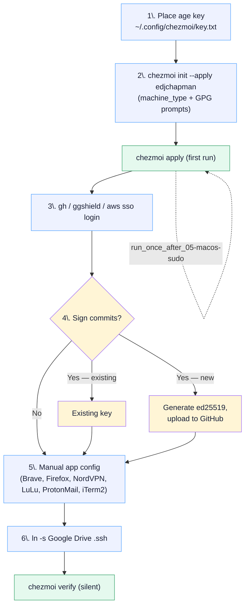

# Runbook: bootstrap a new Mac

End-to-end procedure to take a fresh macOS install to fully configured. Total wall-clock time: ~30 minutes (mostly waiting on Homebrew).

## At a glance



## Prerequisites

- The age private key from your existing machine. It lives at `~/.config/chezmoi/key.txt` and is a single short text file. Transfer via AirDrop, encrypted USB stick, or a password manager — never email or chat.
- A GitHub account with SSH or HTTPS access to `edjchapman/dotfiles`.
- Apple ID signed in (for Mac App Store apps installed via `mas`).

## Steps

### 1. Place the age key

!!! danger "Cannot continue without this"
    Without the age key, every `*.age` blob in the repo is undecryptable and `chezmoi apply` will fail at the decrypt step. Transfer via AirDrop, encrypted USB, or a password manager — **never email or chat**.

```bash
mkdir -p ~/.config/chezmoi
# move/AirDrop key.txt into ~/.config/chezmoi/key.txt
chmod 600 ~/.config/chezmoi/key.txt
```

This is the **only** manual file transfer needed.

### 2. Bootstrap

```bash
sh -c "$(curl -fsLS get.chezmoi.io)" -- init --apply edjchapman
```

You will be prompted twice:

- **Machine type** — `personal` includes Steam, Tidal, crypto wallets; `work` skips them.
- **GPG signing key ID** — leave empty if you don't sign commits.

What this triggers, in order:

1. Clone the repo to `~/.local/share/chezmoi`.
2. Fetch `oh-my-zsh` (pinned SHA) and `claude-code-config` (HEAD) into `~/.oh-my-zsh` and `~/.config/claude-code-config`.
3. Run `run_once_01-install-homebrew.sh` — installs Homebrew if absent.
4. Run `run_onchange_02-brew-bundle.sh.tmpl` — installs every formula, cask, App Store app, and VS Code extension declared in `Brewfile.tmpl`.
5. Run `run_onchange_03-macos-defaults.sh` — applies all `defaults write` entries (Dock, Finder, keyboard, screenshots, privacy).
6. Run `run_onchange_04-dock-layout.sh.tmpl` — sets Dock contents via `dockutil`.
7. Run `run_once_after_05-macos-sudo.sh` — prompts for password, configures firewall, stealth, Touch ID for sudo, energy, auto-updates.
8. Deploy every `dot_*` file to `$HOME` and decrypt every `encrypted_*` file.
9. Run `run_onchange_after_07-claude-global-symlinks.sh` — wires `~/.claude/{CLAUDE.md,settings.json,agents,commands,rules,skills}` as symlinks into the `claude-code-config` clone (delegates to that repo's `scripts/setup-global.sh`).

### 3. Authenticate tooling

```bash
gh auth login                  # GitHub CLI — for PR workflow + git credentials
ggshield auth login            # GitGuardian — pre-commit secret scanning
aws sso login                  # AWS SSO — default profile
```

### 4. GPG (if signing commits)

=== "Existing key"

    ```bash
    gpg --list-secret-keys --keyid-format long
    chezmoi init                   # re-prompts; paste the key ID
    ```

=== "New key"

    ```bash
    gpg --quick-gen-key "Ed Chapman <edchapman88@gmail.com>" ed25519 sign 0
    gh auth refresh -s write:gpg_key
    gpg --armor --export <KEY_ID> | gh gpg-key add -
    chezmoi init
    ```

    Replace the email address with your own before running.

### 5. Manual app config

These can't be templated — they require in-app sign-in or System Settings clicks.

- **Brave** — set as default browser; Shields aggressive; DuckDuckGo; install Dashlane extension.
- **Firefox** — DuckDuckGo, Dashlane.
- **NordVPN** — Kill Switch on, NordLynx, Auto-connect, Threat Protection on, Analytics off.
- **LuLu** — launch once, approve System and Network Extensions.
- **ProtonMail** — sign in.
- **iTerm2** — launch once to populate `~/.config/iterm2/`.

### 6. SSH keys

Sign in to **Google Drive** (installed via Brewfile), wait for sync, then symlink:

```bash
ln -s ~/Google\ Drive/My\ Drive/.ssh ~/.ssh
```

## Verification

- [ ] `chezmoi doctor` — all checks pass
- [ ] `chezmoi verify` — silent (zero drift)
- [ ] `git -C ~/.local/share/chezmoi log --show-signature -1` — GPG signature valid (if configured)
- [ ] Open a new terminal — shell banner should NOT show drift
- [ ] `gh auth status` — GitHub access works
- [ ] `mac` — exits cleanly, "nothing pending"

```bash
chezmoi doctor               # all checks should pass
chezmoi verify               # silent = zero drift
git -C ~/.local/share/chezmoi log --show-signature -1   # confirms GPG signing if configured
```

If `chezmoi verify` reports drift, see [`recover-from-drift.md`](recover-from-drift.md).

## See also

- [Recover from drift](recover-from-drift.md) — when `chezmoi verify` shows pending changes.
- [Secret rotation](secret-rotation.md) — when you need to rotate the age key or a secret.
- [Brew sync](brew-sync.md) — keeping `Brewfile.tmpl` in step with `brew install`.
- [Architecture](../architecture.md) — system overview to understand what the bootstrap is setting up.
