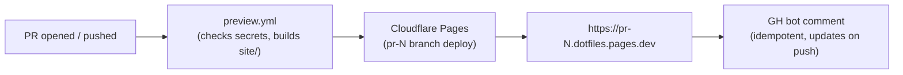

# Runbook: PR preview deploys for the docs site

Production deploys to `https://edjchapman.github.io/dotfiles/` via the `pages.yml` workflow. **Per-PR previews** to a unique URL like `https://pr-59.dotfiles-z7a.pages.dev` are handled by `preview.yml` via Cloudflare Pages — free, auto-cleaned, comment posted on the PR with the URL.

Cloudflare appends a 3-char suffix (`-z7a`) to the project subdomain for uniqueness across all customers. The exact suffix is hardcoded as `CF_SUBDOMAIN` in `.github/workflows/preview.yml`; update there if you rename the subdomain in CF dashboard → Pages → Settings → Domains.

## How it works



Cloudflare handles:

- TLS + CDN
- Unique URL per PR branch
- Auto-cleanup when the PR closes (preview retained 30 days)
- Build artefact caching

## One-time setup (15 minutes)

### 1. Create a Cloudflare account + Pages project

- Sign up at https://dash.cloudflare.com if you don't have an account.
- Pages → Create a project → Connect to Git → select `edjchapman/dotfiles`.
- **Project name**: `dotfiles` (must match `--project-name=dotfiles` in `preview.yml`).
- Build settings: leave blank — the workflow does the build, not Cloudflare.

### 2. Generate an API token

- Cloudflare dashboard → My Profile → API Tokens → Create Token.
- Use the **Edit Cloudflare Workers** template, then customise:
  - **Permissions**: Account → Cloudflare Pages → Edit.
  - **Account Resources**: include your account only.
- Copy the token immediately (it's only shown once).

### 3. Add two secrets to the GitHub repo

```bash
gh secret set CLOUDFLARE_API_TOKEN
gh secret set CLOUDFLARE_ACCOUNT_ID
```

The account ID is in the Cloudflare dashboard sidebar (or `Account Home → Account ID`).

### 4. Open or push a PR

The `preview.yml` workflow fires, builds the docs, deploys, and the GH bot posts a comment with the preview URL.

## Operational notes

- **Soft gate**: if the secrets are missing, the workflow exits early with a notice and a green check. It will not block PR merges — the `docs.yml` aggregate check is the gate.
- **Fork PRs**: the `if: github.event.pull_request.head.repo.full_name == github.repository` guard skips fork PRs (they can't access repo secrets). Manual deploy via `workflow_dispatch` is the workaround.
- **Concurrency**: previews for the same branch cancel in-progress runs. Only the latest commit's preview survives.
- **Idempotent comment**: the bot finds an existing `<!-- docs-preview -->` comment and edits it in place rather than spamming the PR.
- **Site URL handling**: `preview.yml` strips the GitHub Pages `site_url` so relative links resolve against the Cloudflare origin. The production build keeps the canonical URL.
- **Cost**: Cloudflare Pages free tier covers 500 builds/month and unlimited bandwidth. Far over what this repo needs.

## Disabling

To turn off PR previews:

- Remove `CLOUDFLARE_API_TOKEN` and/or `CLOUDFLARE_ACCOUNT_ID` from repo secrets — the workflow auto-skips.
- Or delete `.github/workflows/preview.yml`.

The `docs.yml` checks workflow is independent and continues regardless.

## Troubleshooting

| Symptom | Cause | Fix |
|---|---|---|
| Workflow exits "Cloudflare secrets not configured" | One or both secrets missing | `gh secret list` to confirm; re-add via `gh secret set`. |
| Comment posts but URL 404s | First-time deploy + DNS propagation | Wait 2 minutes; refresh. |
| Build fails on Cairo | apt repo flake | Re-run the job. |
| Preview shows old content | Cache | Append `?nocache=1` to URL. Cloudflare's edge cache flushes within ~30 s of a deploy. |

## See also

- [Branch protection](branch-protection.md) — required CI checks; preview is intentionally NOT required.
- [`pages.yml`](https://github.com/edjchapman/dotfiles/blob/main/.github/workflows/pages.yml) — the production deploy.
- [`preview.yml`](https://github.com/edjchapman/dotfiles/blob/main/.github/workflows/preview.yml) — the per-PR preview deploy.
