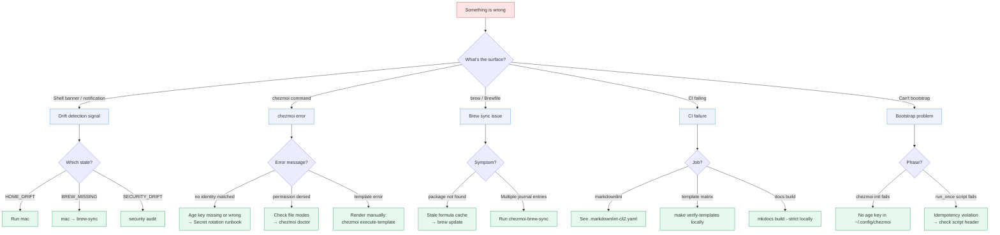

# Troubleshooting

Symptom-driven index. Find your error message, jump to the fix.



## chezmoi errors

### `chezmoi apply` fails with "no identity matched any of the recipients"

**Cause**: The private age key at `~/.config/chezmoi/key.txt` is missing, world-readable, or doesn't match the recipient declared in `.chezmoi.toml.tmpl`.

**Fix**:

```bash
# 1. Confirm the key file exists and has 0600 perms.
ls -l ~/.config/chezmoi/key.txt
# Expected: -rw------- 1 ed staff ...

# 2. Confirm the public half matches the recipient.
age-keygen -y ~/.config/chezmoi/key.txt
# Compare against `recipient` line in .chezmoi.toml.tmpl.

# 3. If you've rotated the key recently but didn't re-encrypt all blobs,
#    follow Secret rotation → "Rotate the age key itself".
```

See [Secret rotation](runbooks/secret-rotation.md).

### `chezmoi apply` reports drift but `chezmoi diff` shows nothing

**Cause**: The drift cache (`~/.cache/chezmoi-drift/state`) is stale.

**Fix**:

```bash
rm -rf ~/.cache/chezmoi-drift
mac  # repopulates the cache
```

### `chezmoi verify` returns non-zero with empty stderr

**Cause**: A file in `$HOME` has different permissions than the source expects, but the *content* matches. `verify` checks both.

**Fix**: Run `chezmoi apply -v` (verbose) to see what specifically is being changed. Usually a permission fix.

## Brew sync issues

### `chezmoi-brew-sync` says "package not found"

**Cause**: A package in `~/.cache/brewup.log` is no longer in any tap chezmoi can reach.

**Fix**:

```bash
brew update
chezmoi-brew-sync  # try again
```

If still failing, the package was likely from a deprecated tap. Remove the offending line from `~/.cache/brewup.log` manually and re-run.

### Brew sync prompts for the same entry twice

**Cause**: The dedup logic considers package name + flags. If you `brew install foo` then `brew install --HEAD foo`, those are two distinct entries.

**Fix**: Accept both at the first prompt; the second pass will skip the duplicate.

See [Brew sync runbook](runbooks/brew-sync.md).

## Drift detection signals

### Shell banner shows drift but `mac` says nothing's pending

**Cause**: The banner reads `~/.cache/chezmoi-drift/state` (cheap, instant); `mac` re-runs the full check (slow, accurate). Cache is sometimes ahead of reality.

**Fix**: Just run `mac`. The cache rewrites.

### Daily 09:30 notification didn't fire

**Cause**: LaunchAgent not loaded, or screen was locked at 09:30 and the OS deferred it past midnight.

**Fix**:

```bash
# Confirm the LaunchAgent is loaded.
launchctl list | grep chezmoi-drift

# Trigger manually.
launchctl kickstart -k gui/$UID/com.edjchapman.chezmoi-drift
```

See [Recover from drift](runbooks/recover-from-drift.md).

## CI failures

### `markdownlint` fails on a file you didn't edit

**Cause**: A new markdownlint rule version flagged something that was always there. The repo's `.markdownlint-cli2.yaml` disables a few rules (long lines, bare URLs); a new rule may need disabling.

**Fix**: Read the failing rule's docs ([rule list](https://github.com/DavidAnson/markdownlint/blob/main/doc/Rules.md)). If genuinely a false positive for this project, add to `.markdownlint-cli2.yaml`.

### `chezmoi templates (work / amd64)` fails

**Cause**: A template branch is referenced for one machine_type or arch but not implemented.

**Fix**:

```bash
# Reproduce locally.
make verify-templates

# Or just the failing cell.
chezmoi execute-template \
    --init --source="$(pwd)" \
    --override-data '{"machine_type":"work","gpg_signing_key":"test","chezmoi":{"arch":"amd64"}}' \
    < path/to/failing.tmpl
```

### `docs checks passed` fails with "mkdocs build --strict" error

**Cause**: New page added but not in `nav:`; or a `[link][undef]` reference; or a code block has an unknown language tag.

**Fix**:

```bash
# Reproduce locally (after pip install -r docs/requirements.txt).
mkdocs build --strict
```

See [Branch protection](runbooks/branch-protection.md).

## Bootstrap problems

### First `chezmoi init --apply edjchapman` fails immediately

**Cause**: The age private key isn't in `~/.config/chezmoi/key.txt`.

**Fix**: Drop the key file there first, then re-run `chezmoi init`. The [new-machine runbook](runbooks/new-machine.md) covers the full procedure.

### `run_once_*` script fails on second run

**Cause**: Idempotency violation. `run_once` scripts should be re-entrant; if they can't, they need state-detection at the top.

**Fix**: Run `chezmoi state delete-bucket --bucket=scriptState` to wipe the state DB and re-run. **This is destructive** — re-runs every `run_once_*` again.

## See also

- [Recover from drift](runbooks/recover-from-drift.md)
- [Secret rotation](runbooks/secret-rotation.md)
- [Brew sync](runbooks/brew-sync.md)
- [Gotchas](gotchas.md)
- [FAQ](faq.md)
